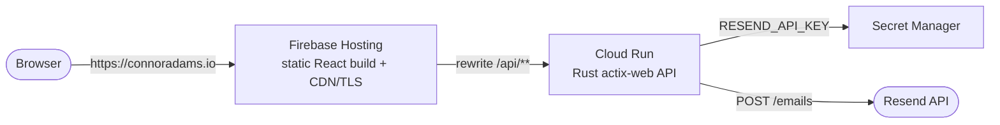

# C. Adams — Personal Portfolio

A personal portfolio site: a **Vite + React 19** single-page app backed by a small **Rust (actix-web)** API that powers the contact form. It's deployed on Google Cloud as a static site on **Firebase Hosting** with the API on **Cloud Run**, served under one origin so the browser never makes a cross-origin request.

- **Live:** https://my-website-500818.web.app  (custom domain `connoradams.io` in progress)
- **Frontend:** React 19 · Vite · Tailwind CSS v4
- **Backend:** Rust · actix-web · Resend (transactional email)
- **Infra:** Firebase Hosting + Cloud Run, CI/CD via GitHub Actions (keyless / Workload Identity Federation)

## Architecture



The frontend is fully static. Its only dynamic dependency is the contact form, which `POST`s to `/api/contact`. In production a Firebase Hosting **rewrite** forwards `/api/**` to the Cloud Run service, so the API is same-origin (`connoradams.io/api/...`) — no CORS, no separate `api.` subdomain.

## Repository layout

```
My-Website/
├── backend/                  # Rust actix-web API
│   ├── src/
│   │   ├── main.rs           # server bootstrap, CORS, route wiring (/ and /api scope)
│   │   └── handlers.rs       # health + contact handler (validates, escapes, sends via Resend)
│   ├── Dockerfile            # multi-stage build → distroless runtime
│   ├── .dockerignore
│   ├── .env.example          # template; copy to .env.local (gitignored)
│   └── Cargo.toml
├── frontend/                 # Vite + React 19 + Tailwind v4 SPA
│   ├── src/
│   │   ├── components/        # UI (utility-first Tailwind; complex bits in index.css @layer)
│   │   ├── context/           # ThemeContext (light/dark via [data-theme])
│   │   ├── hooks/             # useScrollReveal
│   │   ├── data/content.js    # site copy (education, projects, …)
│   │   ├── index.css          # Tailwind entry + @theme token mapping + @layer components
│   │   └── theme.css          # CSS-variable design tokens + base typography
│   ├── index.html             # Vite entry (pre-paint theme script)
│   ├── vite.config.js
│   ├── eslint.config.js
│   ├── .env.development        # VITE_API_URL → local backend
│   └── .env.production         # VITE_API_URL → /api (same-origin)
├── docs/
│   ├── deployment-roadmap.md  # full deploy + CI/CD plan and status
│   └── contact-form.md        # contact form + Resend setup
├── firebase.json              # Hosting config: serves frontend/build, /api/** rewrite, SPA fallback
├── .firebaserc                # default GCP/Firebase project (my-website-500818)
└── .github/workflows/         # deploy-backend.yml, deploy-frontend.yml
```

## Tech stack

| Area | Choices |
| --- | --- |
| Frontend | React 19, Vite, Tailwind CSS v4, React Context (theming) |
| Backend | Rust, actix-web, actix-cors, reqwest (rustls), serde, dotenvy |
| Email | Resend |
| Hosting | Firebase Hosting (static) + Cloud Run (API) |
| Secrets | Google Secret Manager |
| CI/CD | GitHub Actions + Workload Identity Federation (keyless) |

## Prerequisites

- **Rust** (stable toolchain) + `cargo` — for the backend
- **Node.js 20+** and **npm** — for the frontend
- For deployment/infra only: **`gcloud`** CLI and **Firebase CLI** (`firebase-tools`), each authenticated

## Local development

The frontend and backend run independently. For the contact form to work locally you need both running (and a Resend key in the backend).

### 1. Backend (API)

```bash
cd backend
cp .env.example .env.local     # then fill in real values (see "Environment variables")
cargo run                      # serves http://127.0.0.1:8080  ( / and /api/contact )
```

`cargo run` works without `.env.local`, but `/api/contact` will return a 500 ("email service is not configured") until `RESEND_API_KEY` and `CONTACT_TO_EMAIL` are set. `.env.local` is **gitignored** — never commit it.

### 2. Frontend (SPA)

```bash
cd frontend
npm install
npm run dev                    # http://localhost:5173
```

In dev, `frontend/.env.development` points the contact form at `http://127.0.0.1:8080/api`, so start the backend too if you want to exercise the form end-to-end.

## Scripts

**Frontend** (`cd frontend`):

| Command | Description |
| --- | --- |
| `npm run dev` | Vite dev server at http://localhost:5173 |
| `npm run build` | Production build → `frontend/build/` |
| `npm run preview` | Serve the production build locally |
| `npm run lint` | ESLint over `src/` |

**Backend** (`cd backend`):

| Command | Description |
| --- | --- |
| `cargo run` | Run the API at `127.0.0.1:8080` |
| `cargo build --release` | Optimized build (what the container ships) |
| `cargo check` | Fast type-check |
| `cargo fmt` / `cargo clippy` | Format / lint (recommended before pushing) |

## Environment variables

**Backend**

| Variable | Required | Description |
| --- | --- | --- |
| `RESEND_API_KEY` | Yes (to send mail) | Resend API key. From **Secret Manager** in prod; `.env.local` in dev. |
| `CONTACT_TO_EMAIL` | Yes | Inbox that receives contact submissions. |
| `CONTACT_FROM_EMAIL` | No (has default) | Verified Resend sender, e.g. `Portfolio Contact <contact@connoradams.io>`. |
| `PORT` | No | Listen port. Cloud Run injects this; defaults to `8080`. |

**Frontend** (Vite, must be prefixed `VITE_`)

| Variable | Description |
| --- | --- |
| `VITE_API_URL` | API base for the contact form. `.env.development` → `http://127.0.0.1:8080/api`; `.env.production` → `/api`. |

## Styling / design system

Tailwind v4 is the styling layer. Design tokens (colors, spacing, radius, shadows, type) live as CSS variables in `frontend/src/theme.css` and are mapped into Tailwind via `@theme` in `index.css`, so utilities resolve to tokens. **Dark mode** switches on `[data-theme="dark"]` (set by `ThemeContext` before first paint) and is wired to Tailwind's `dark:` variant via `@custom-variant`. Most components use utility classes directly; a few intricate pieces (sticky header/nav, the résumé mock, form controls) are kept as scoped classes in an `@layer components` block.

## Deployment

Production = Firebase Hosting (static) + Cloud Run (API), GCP project `my-website-500818`, region `us-central1`. See `docs/deployment-roadmap.md` for the full, first-time setup (APIs, secret, org policy, etc.).

### Manual deploy

Backend (re-deploys retain existing env vars + secrets):

```bash
gcloud run deploy backend --source backend --region us-central1 --project my-website-500818
```

Frontend:

```bash
cd frontend && npm run build
firebase deploy --only hosting --project my-website-500818
```

### CI/CD (GitHub Actions)

Pushes to `main` deploy automatically (path-filtered):

- `backend/**` → `.github/workflows/deploy-backend.yml` → Cloud Run
- `frontend/**` or `firebase.json`/`.firebaserc` → `.github/workflows/deploy-frontend.yml` → Firebase Hosting

Authentication is **keyless** via Workload Identity Federation — no service-account JSON keys are stored. The workflows read three repo **Variables** (Settings → Secrets and variables → Actions → Variables): `GCP_PROJECT`, `GCP_SERVICE_ACCOUNT`, `GCP_WIF_PROVIDER`. A dedicated `github-deployer` service account holds only the roles needed to deploy.

## Security standards

- **No secrets in the repo.** `RESEND_API_KEY` lives in Secret Manager (injected into Cloud Run at runtime); `backend/.env.local` is gitignored; `.env.example` contains placeholders only.
- **Keyless CI.** GitHub Actions authenticate to GCP via Workload Identity Federation (OIDC), scoped to this repository — no long-lived keys to leak or rotate.
- **Least privilege.** A dedicated `github-deployer` service account is granted only deploy-related roles. The Resend API key is created sending-only and restricted to the `connoradams.io` domain.
- **Locked CORS.** The API allows only `https://connoradams.io`, `https://www.connoradams.io`, and localhost dev origins. In production the call is same-origin anyway (Hosting rewrite).
- **Hardened runtime.** The backend ships as a multi-stage **distroless** image (no shell, minimal attack surface).
- **Safe input handling.** The contact handler validates required fields, checks the email shape, and HTML-escapes all values before composing the message.
- **Managed TLS.** Firebase Hosting and Cloud Run provide and renew certificates automatically.
- **Recommended next** (tracked in the roadmap, Phase 5): a honeypot field + basic rate limiting on the contact endpoint to deter spam/abuse.

If you discover a security issue, please report it privately to the maintainer rather than opening a public issue.

## Contributing / workflow

1. Branch off `main` and open a pull request.
2. Before pushing: run `npm run lint` (frontend) and `cargo fmt` + `cargo clippy` (backend); make sure `npm run build` and `cargo check` pass.
3. Keep secrets out of commits (`.env.local` is gitignored — keep it that way).
4. Merging to `main` triggers the deploy workflows, so treat `main` as production.

## Documentation

- `docs/deployment-roadmap.md` — phased deployment + CI/CD plan with current status.
- `docs/contact-form.md` — contact form and Resend configuration.

## License

Personal project © Connor Adams. Not currently licensed for external reuse — please ask before reusing.
