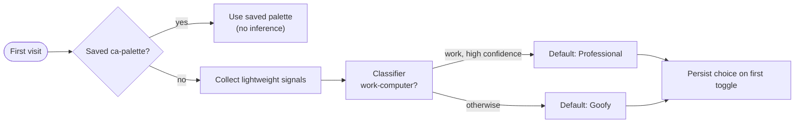

# Adaptive theme roadmap

A phased plan to **automatically pick a default palette for first-time visitors**
using a small, privacy-first model: visitors who look like they're on a **work
computer** default to the **Professional** palette (forest green + cabernet);
everyone else gets the playful **Goofy** (Red Panda) palette.

This is a **future** enhancement. None of it is implemented yet — today the
first-time default is hardcoded to Goofy in `getInitialPalette()`
(`frontend/src/context/ThemeContext.jsx`) and the pre-paint script in
`frontend/index.html`.

## Goal & guardrails

Make a good *first impression* per audience without ever overriding a real
choice or shipping anything creepy.

- **Returning visitors always win.** A saved `ca-palette` in `localStorage`
  short-circuits all inference — the model only runs when there is no stored
  preference.
- **Privacy-first.** Prefer signals the browser already exposes; no
  fingerprinting, no third-party trackers, no PII. Inference should be
  explainable and cheap.
- **Graceful default.** Any error, low confidence, or missing signal falls back
  to Goofy (the current behavior), so the site is never worse off.
- **Reversible & obvious.** The `PaletteToggle` in the header always lets a
  visitor flip palettes; an auto-pick is just a starting point.

## Candidate signals (all client-side, non-PII)

No single signal is reliable; the value is in combining weak ones.

- **Locale & time:** `Intl.DateTimeFormat().resolvedOptions().timeZone`, language,
  and **local time-of-day / weekday** (work hours on a weekday nudges toward work).
- **User-Agent Client Hints:** platform, mobile flag, and (where available)
  `navigator.userAgentData.getHighEntropyValues` for platform/version — desktop
  Windows during business hours is a mild "work" signal; mobile is a strong
  "not work" signal.
- **Form factor:** screen size, `pointer`/`hover` media queries, device pixel
  ratio — large fixed displays with a fine pointer skew toward desktop/work.
- **Referrer / entry context:** arriving from LinkedIn, a job board, or a
  recruiter link is a strong Professional signal; arriving from social/personal
  links skews Goofy. UTM params (if present) are a clean, explicit hint.
- **Network (coarse, optional):** `navigator.connection` effective type as a
  weak tiebreaker only.

Explicitly **out of bounds:** IP geolocation lookups, canvas/font fingerprinting,
ad-network identifiers, or anything stored without consent.

## Architecture

Keep it static-first so the existing Firebase Hosting + Cloud Run setup is
unchanged (see `docs/deployment-roadmap.md`).

- **Where it plugs in:** a `resolveDefaultPalette()` step that runs only when
  `localStorage` has no `ca-palette`, feeding the same code paths that already
  set `data-palette` — the pre-paint script (`index.html`) and
  `getInitialPalette()` (`ThemeContext.jsx`).
- **Model home:** a tiny model (logistic regression / shallow decision tree)
  exported to run **in-browser** (plain JS weights or a small ONNX/TF.js
  artifact). No network round-trip on first paint; inference is synchronous and
  sub-millisecond.
- **First-paint nuance:** the pre-paint script must stay tiny and flash-free, so
  ship either a heuristic-only baseline inline, or apply the model result right
  after hydration with a one-frame transition (accepting a brief Goofy default
  on the very first paint).

## Phase 0 — Heuristic baseline (no ML)
- [ ] Implement `resolveDefaultPalette()` with a hand-tuned weighted score over
  the signals above; threshold → Professional, else Goofy.
- [ ] Gate it behind a flag; keep Goofy as the default until tuned.
- [ ] Add lightweight, anonymous, aggregate-only telemetry: which default was
  chosen and whether the visitor toggled away from it (the training label).

## Phase 1 — Collect labels
- [ ] Treat "auto-picked palette" vs. "palette after first manual toggle" as the
  supervised label.
- [ ] Store only anonymized, aggregated feature vectors + label — no raw
  identifiers. Document retention.

## Phase 2 — Train & ship a model
- [ ] Train offline; evaluate against the heuristic (accuracy + a strong bias
  toward not annoying Goofy-preferring visitors).
- [ ] Export compact weights; load and run client-side in
  `resolveDefaultPalette()`. Keep the heuristic as the fallback.

## Phase 3 — Monitor & iterate
- [ ] Track "toggle-away rate" by predicted class as the north-star metric.
- [ ] Add a kill-switch + config-driven threshold so it can be tuned or disabled
  without a redeploy.

## Alternatives considered
- **Pure `prefers-color-scheme`-style heuristic, no model:** simplest and may be
  enough; Phase 0 is exactly this and might become the permanent solution.
- **Server-side inference at the edge** (Cloud Run / a hosting function): access
  to request headers (UA, `Accept-Language`), but adds latency to first paint and
  pulls logic out of the static bundle. Only worth it if client signals prove
  too weak.
- **Explicit one-time prompt** ("Browsing for work or for fun?"): zero inference,
  fully transparent, but adds friction most visitors don't want.

## Open questions
- Is the Professional-vs-Goofy first impression worth *any* inference, or is a
  hardcoded default + an obvious toggle simpler and sufficient?
- Acceptable first-paint behavior: brief Goofy flash then switch, or heuristic
  inline in the pre-paint script?
- Do we need a visible "we picked this for you" affordance to keep it honest?
