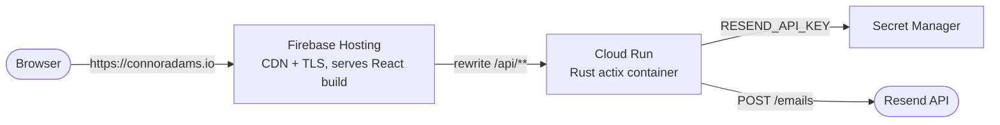

# Production deployment roadmap

A phased plan to launch the site (React frontend + Rust/`actix-web` backend) to
production on **GCP**, served from **connoradams.io**.

## Goal & architecture

Host the static React build on a global CDN and the stateless Rust API on a
scale-to-zero container, served under **one domain** so there is no CORS to
manage.

- **Frontend:** Vite static build (React 19 + Tailwind v4) → **Firebase Hosting** (global CDN, free TLS).
- **Backend:** `actix-web` container → **Cloud Run** (stateless, scales to zero).
- **Same-origin API:** a Firebase Hosting rewrite sends `connoradams.io/api/**`
  to the Cloud Run service, so the browser never makes a cross-origin call.
- **Secrets:** `RESEND_API_KEY` in **Secret Manager**, injected into Cloud Run.



### Why this approach
- **Cost ≈ $0 at idle** — Cloud Run scales to zero; Firebase Hosting's free tier covers a portfolio.
- **Low ops** — no VM, no nginx, no manual TLS renewal; managed certs on both sides.
- **Right-sized** — a static bundle belongs on a CDN; a stateless Rust binary is an ideal Cloud Run container.
- **No CORS** — the same-origin `/api` rewrite removes cross-origin config and avoids an `api.` subdomain.

## Current state (updated 2026-06-29) — LIVE
- **Site:** `https://my-website-500818.web.app` (Firebase Hosting, Vite + React 19 + Tailwind v4 build).
- **Backend:** `https://backend-963952037251.us-central1.run.app` (Cloud Run, public). The `/api/**` Hosting rewrite reaches it same-origin; `POST /api/contact` validates end-to-end (400 on empty body).
- Frontend migrated CRA → **Vite**; backend is Cloud Run-ready (binds `0.0.0.0:$PORT`, CORS locked, `/api` scope, `Dockerfile`).
- To serve a public site under the `connoradams.io` org, a project-level override of the `iam.allowedPolicyMemberDomains` org policy (`allowAll`) was applied so Cloud Run could grant `allUsers` the invoker role.
- Remaining: custom domain `connoradams.io` (Phase 4) and a real Resend send confirmation.

---

## Phase 0 — Prerequisites
- [x] GCP project created with billing enabled.
- [x] `gcloud` CLI installed and authenticated; default project/region set.
- [x] `firebase-tools` CLI installed and authenticated.
- [ ] Registrar access for `connoradams.io` (or delegate the zone to Cloud DNS) — needed for Phase 4.
- [x] Resend account with `connoradams.io` verified (already covered in `docs/contact-form.md`).

## Phase 1 — Make the backend deploy-ready (code) — DONE
- [x] Bind to `0.0.0.0` and read Cloud Run's `PORT` (replaces the hardcoded bind at `backend/src/main.rs:28`):
  ```rust
  let port: u16 = std::env::var("PORT").ok()
      .and_then(|p| p.parse().ok())
      .unwrap_or(8080);
  // ...
  .bind(("0.0.0.0", port))?
  ```
- [x] Namespace the API under `/api` (wrap services in `web::scope("/api")`) so the route becomes `/api/contact`, matching the Hosting rewrite.
- [x] Lock down CORS to the real origins (kept localhost dev origins so `npm run dev` still works):
  ```rust
  let cors = Cors::default()
      .allowed_origin("https://connoradams.io")
      .allowed_origin("https://www.connoradams.io")
      .allowed_methods(["POST"])
      .allow_any_header()
      .max_age(3600);
  ```
- [x] Remove or harden the unused handlers (`/projects`, `/pyrrhus`, `/pyrrhus2/{file}`) — deleted (they `.expect()`-panicked and were unused by the SPA).
- [x] Add a multi-stage `Dockerfile` (rustls is already used, so no OpenSSL needed):
  ```dockerfile
  FROM rust:1-slim AS build
  WORKDIR /app
  COPY . .
  RUN cargo build --release

  FROM gcr.io/distroless/cc-debian12
  COPY --from=build /app/target/release/backend /backend
  ENV PORT=8080
  CMD ["/backend"]
  ```
- [x] Add a `.dockerignore` (exclude `target/`, `.env*`, etc.).

## Phase 2 — Deploy the backend to Cloud Run — DONE
- [x] Stored the secret: piped `RESEND_API_KEY` from `.env.local` into Secret Manager (never printed) + granted the runtime compute SA `secretAccessor`.
- [x] Enabled APIs (run, artifactregistry, cloudbuild, secretmanager) and granted the compute SA `roles/cloudbuild.builds.builder` (required for source builds). Build & deploy:
  ```bash
  gcloud run deploy backend \
    --source backend \
    --region us-central1 \
    --allow-unauthenticated \
    --set-secrets RESEND_API_KEY=resend-api-key:latest \
    --set-env-vars CONTACT_TO_EMAIL=...,CONTACT_FROM_EMAIL="Portfolio Contact <contact@connoradams.io>"
  ```
- [x] Smoke-tested: `GET /` → "Hello from Rust!"; `POST /api/contact` (empty) → 400 validation. A real form submission (Resend send) is still worth confirming once.
- [x] Granted `allUsers` the Cloud Run invoker (after the org-policy override) so Firebase Hosting can reach the service.

## Phase 3 — Deploy the frontend to Firebase Hosting
- [ ] Build the Vite app: `npm run build` (in `frontend/`) — emits to `frontend/build` (Vite `outDir`). `frontend/.env.production` sets `VITE_API_URL=/api`, so the contact form posts same-origin (no manual env needed).
- [x] `firebase.json` (+ `.firebaserc` for project `my-website-500818`) are in the repo, with the API rewrite + SPA fallback:
  ```json
  {
    "hosting": {
      "public": "frontend/build",
      "rewrites": [
        { "source": "/api/**", "run": { "serviceId": "backend", "region": "us-central1" } },
        { "source": "**", "destination": "/index.html" }
      ]
    }
  }
  ```
- [x] `firebase deploy --only hosting` — site live at `https://my-website-500818.web.app`; `/api/contact` rewrite reaches the backend (verified same-origin). Had to add Firebase to the project (Console) + enable the Firebase APIs first.

## Phase 4 — Domain & DNS (connoradams.io)
- [ ] In Firebase Hosting, add custom domains `connoradams.io` and `www.connoradams.io` (redirect `www` → apex).
- [ ] Add the A/AAAA records Firebase provides at the registrar (or manage the zone in Cloud DNS).
- [ ] Confirm managed TLS certs are issued for both hosts.
- [ ] Verify Resend DNS (SPF/DKIM) is unaffected by the change.

## Phase 5 — Hardening & polish
- [ ] Add spam protection to the contact form: a honeypot field + basic rate limiting (already flagged in `docs/contact-form.md`).
- [ ] Confirm unused endpoints are removed/hardened (from Phase 1).
- [ ] Set up logging/alerting (Cloud Run logs are on by default; add an uptime check if desired).
- [ ] Set sane Cloud Run limits (min instances `0`, a modest max, small CPU/memory).

## Phase 6 — CI/CD (GitHub Actions, keyless via WIF)
Repo `ConnorLAdams/My-Website`; deploys on push to `main` (path-filtered). Keyless auth via **Workload Identity Federation** — no long-lived SA keys.
- [x] Workflows added: `.github/workflows/deploy-backend.yml` (Cloud Run) and `.github/workflows/deploy-frontend.yml` (Firebase Hosting).
- [x] WIF pool (`github`) + OIDC provider (`github-provider`, scoped to repo owner `ConnorLAdams`) + `github-deployer` SA with deploy roles (run.admin, iam.serviceAccountUser, cloudbuild.builds.builder, storage.admin, artifactregistry.writer, firebasehosting.admin, serviceUsageConsumer).
- [x] Repo **variables** set: `GCP_PROJECT`, `GCP_SERVICE_ACCOUNT`, `GCP_WIF_PROVIDER`.
- [ ] Activate: merge `version/reactRust` → `main` (GitHub only runs push workflows that exist on the default branch).
- Note: backend redeploys retain existing env vars + secrets.

---

## Alternatives considered
- **All-on-Cloud-Run** (one container where `actix` also serves the static build via `actix-files`): simplest single deploy and one vendor, but no global CDN edge-caching for static assets. Reasonable fallback.
- **Cloud Storage + Cloud CDN + external HTTPS Load Balancer** (frontend) + Cloud Run (backend): most GCP-native with full CDN control, but adds an always-on load balancer (~$18/mo) and more setup. Overkill at this scale.
- **Compute Engine VM + nginx**: most control, most ops (patching, TLS, process management). Not worth it for this size.

## Estimated cost
Realistically **$0–1/month** for a personal portfolio on the recommended setup (domain registration aside).
